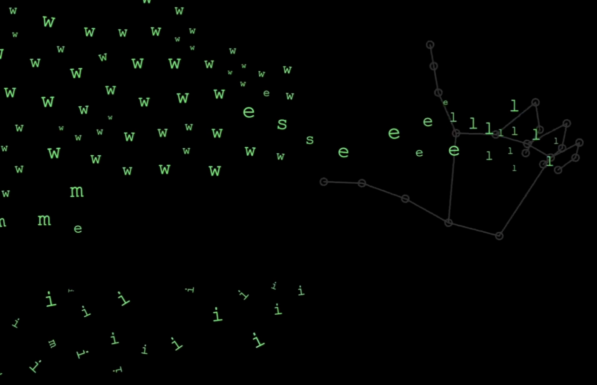
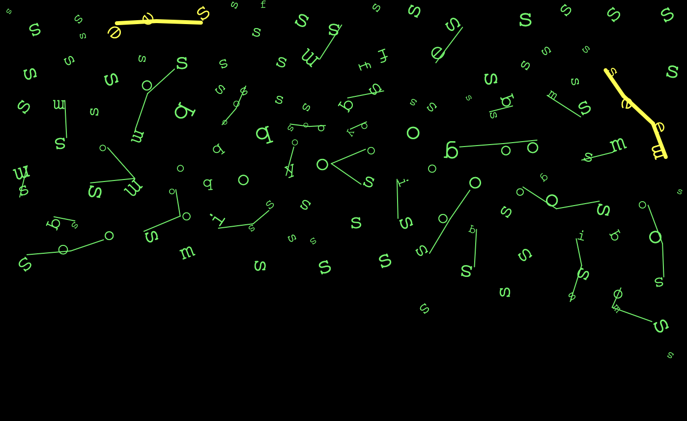

# Bubbly 🫧

A real-time ASL (American Sign Language) recognition project that makes learning sign language fun and interactive. Watch as your hand signs come to life on screen, with letters automatically connecting when they form real words!

## Inspiration

Bubbly was born from a desire to appreciate non-verbal language and create an entertaining way to learn something new. By combining technology with education, Bubbly transforms ASL practice into an engaging, visual experience that celebrates the beauty of sign language.

## What It Does

Bubbly uses your webcam to track your right hand in real-time and recognizes ASL finger-spelled letters. As you sign, letters appear on screen. When the letters you've signed form actual words or word prefixes, they automatically connect together visually, creating a satisfying and educational feedback loop.
This visual connection system helps learners to see immediate feedback on their signing, improve awareness of specific gestures and angles, and understand word formation in a unique, interactive way.

## Tech Stack

- **p5.js** - Creative coding framework for visualization and interaction
- **TensorFlow.js** - Machine learning model for hand pose detection and ASL recognition
- **MediaPipe** - Real-time hand landmark detection

## Features

- **Real-time Recognition** - Instant ASL letter detection using your right hand
- **Smart Word Detection** - Automatically identifies when signed letters form valid words or prefixes
- **Visual Connections** - Letters dynamically connect on screen when they form meaningful combinations
- **Educational & Entertaining** - Learn ASL through interactive, visual feedback

## Demo (Stage 1)
Visit https://youtu.be/7ZiGdUQ6UsY for a demo on the first version of this program

## Demo (Stage 1 - Image)

## Prerequisites
To play with this program, you will need a  modern web browser, webcam access, and preferably good lighting for optimal hand tracking.

TODO: installation

## How to Use

1. Position yourself in front of your webcam with good lighting
2. Hold your right hand in view of the camera
3. Sign ASL letters one at a time
4. Watch as letters appear on screen
5. When your letters form words or word prefixes, they'll automatically connect!
6. Keep practicing and watch the bubbles connect

## Future Plans

- Improve recognition accuracy
- Expanded vocabulary recognition
- Enhance visual effects

---

Hope you enjoy a little game of sign language!
