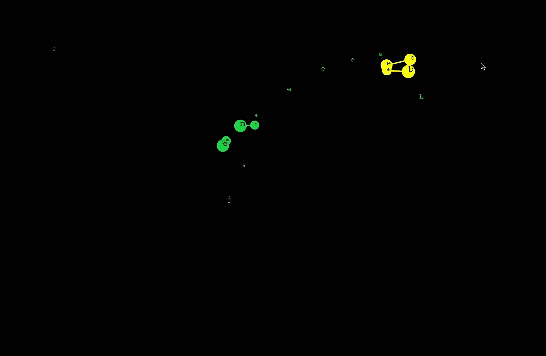
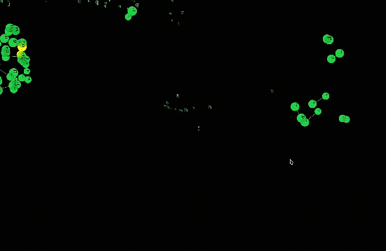
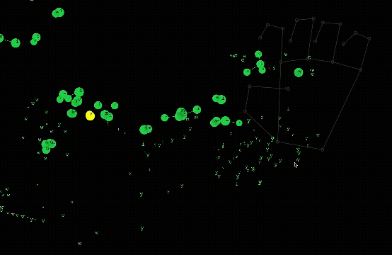
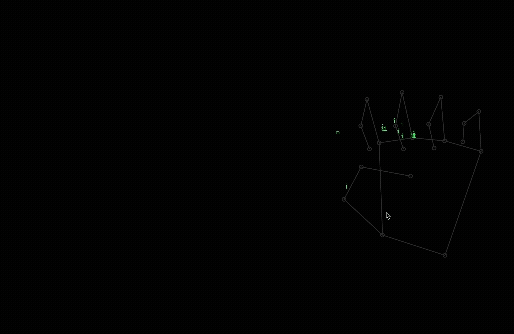
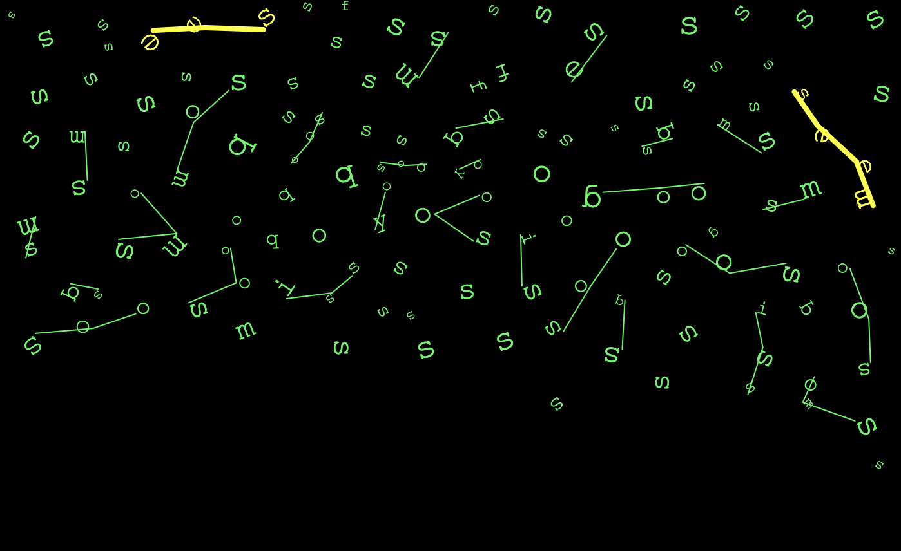

# Bubbly 🫧

A real-time interactive game that leverages an ASL (American Sign Language) recognition model to form words. Watch as your hand signs come to life on screen, with letters automatically connecting when they form real words!

<!--  -->
<video controls width="100%" height="100%">
    <source src="./assets/intro.mp4" type="video/mp4">
</video>

<!-- ## Inspiration

Bubbly was born from a desire to appreciate non-verbal language and create an entertaining way to learn something new. By combining technology with education, Bubbly transforms ASL practice into an engaging, visual experience that celebrates the beauty of sign language. -->

## What It Does

Bubbly uses your webcam to track your right hand in real-time and recognizes ASL finger-spelled letters. As you sign, letters appear on screen. When the letters you've signed form actual words or word prefixes, they automatically connect together visually, creating a satisfying and educational feedback loop.
This visual connection system helps learners to see immediate feedback on their signing, improve awareness of specific gestures and angles, and understand word formation in a unique, interactive way.

### Letters Can Form Words

When signed letters are spatially close and spell a valid word, they visually snap together.

<!--  -->
<video controls>
    <source src="./assets/make_words.mp4" type="video/mp4">
</video>

## Experiment — February 25, 2026

This update introduces **spatial hashing** for efficient neighbor detection among letter bubbles. Previously, finding neighboring letters required comparing every bubble against every other bubble — an O(n²) operation. With spatial hashing, the canvas is divided into a grid of cells, and each bubble is registered into the cell it occupies. Neighbor lookups then only check bubbles in adjacent cells, reducing the cost of neighbor queries dramatically as the number of bubbles grows.

This creates richer, more performant force interactions between letters, making the simulation feel more alive without sacrificing frame rate.

### Letters Have Noise Force

Each letter bubble is now influenced by a Perlin noise field, giving them organic, flowing movement rather than static or purely physics-driven behavior.

<!--  -->
<video controls>
    <source src="./assets/noise.mp4" type="video/mp4">
</video>

### Density-Based Force

Letters now respond to local density: when too many letters crowd together, repulsive forces push them apart.

<!--  -->
<video controls>
    <source src="./assets/density.mp4" type="video/mp4">
</video>

### Merge(Weird) Force

If too many of the same word crowd together, they merge into one. This feature is still being implementated, as you can see the merge direction isn't correct

<video controls>
    <source src="./assets/weird.mp4" type="video/mp4">
</video>

## Tech Stack

- **p5.js** - Creative coding framework for visualization and interaction
- **TensorFlow.js** - Machine learning model for hand pose detection and ASL recognition
- **MediaPipe** - Real-time hand landmark detection

## Features

- **Real-time Recognition** - Instant ASL letter detection using your right hand
- **Smart Word Detection** - Automatically identifies when signed letters form valid words or prefixes
- **Visual Connections** - Letters dynamically connect on screen when they form meaningful combinations
- **Educational & Entertaining** - Learn ASL through interactive, visual feedback

<!-- ## Demo (Stage 1)
Visit https://youtu.be/7ZiGdUQ6UsY for a demo on the first version of this program

## Demo (Stage 2 - Image)
 -->

## Prerequisites
To play with this program, you will need a  modern web browser, webcam access, and preferably good lighting for optimal hand tracking.

## How to Use

1. Position yourself in front of your webcam with good lighting
2. Hold your right hand in view of the camera
3. Sign ASL letters one at a time
4. Watch as letters appear on screen
5. When your letters form words or word prefixes, they'll automatically connect!
6. Keep practicing and watch the bubbles connect

## Future Plans

- Improve recognition accuracy
- Expand vocabulary recognition
- Implement custom word-based or letter-based forces
- 

---

Hope you enjoy a little game of sign language!
